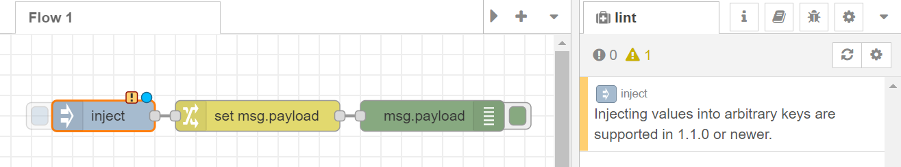

# nrlint-plugin-rules-compat
Flow compatibility check rule plugin for nrlint

__Under development: use for design discussion__

Depending on the version of the Node-RED runtime, there are differences
in the features available on each node.
Because of this, a flow developed in a newer/older version of 
Node-RED may not work properly if you try to export it to an older/newer
version of Node-RED.

For example:
- since v1.1.0, it has been possible to set any properties in the inject node, 
  so if you try to use a flow that uses this feature with a runtime prior to v1.1.0,
  you will have problems.
- Tail node is removed from default dependency since v2.0.0
  You need to explicitly install the tail node in order to run flows that contain
  the tail node in runtimes v2.0.0 or newer.

This rule plugin detect version incompatibility issues in the flow and notifies the developer.



## Usage

### 1. install 
```sh
% gh repo clone k-toumura/nrlint-plugin-rules-compat
% cd nrlint-plugin-rules-compat
% npm install
% npm run build
% cd ~/.node-red
% npm install <path-to-this-plugin>
% npm install -g <path-to-this-plugin>    # need to use from CLI
```

### 2. configure

add following setting to ~/.node-red/.nrlintrc.js
```javascript
module.export = {
    "plugins": [
        "nrlint-plugin-rules-compat"
    ],
    "rules": {
        "compat": {
            "targetVersions": {
                // Extract problems when running flow on Node-RED version specified here
                "node-red": "2.1.3",    
            },
        },
        // ...
    }
}
```

### 3. run

Restart Node-RED, or
```sh
% npx nrlint myFlowFile.json
```
in `~/.node-red`.


